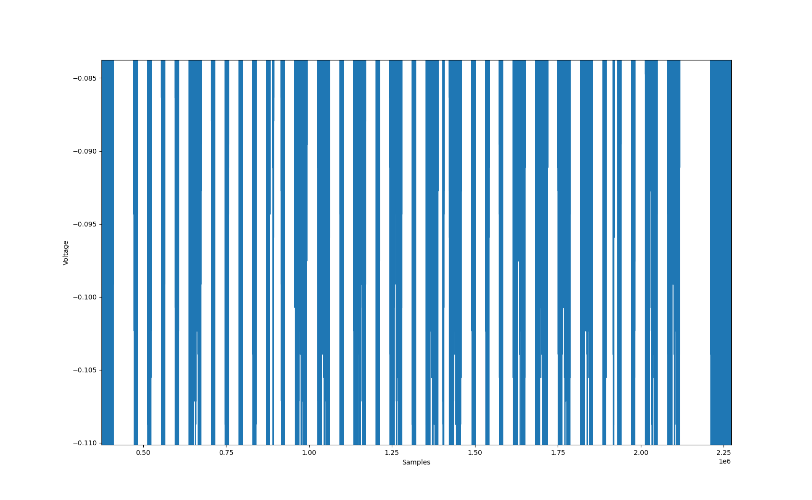
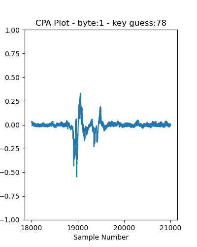
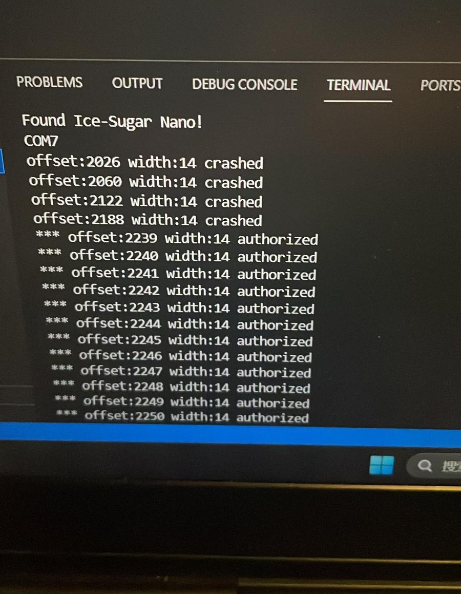
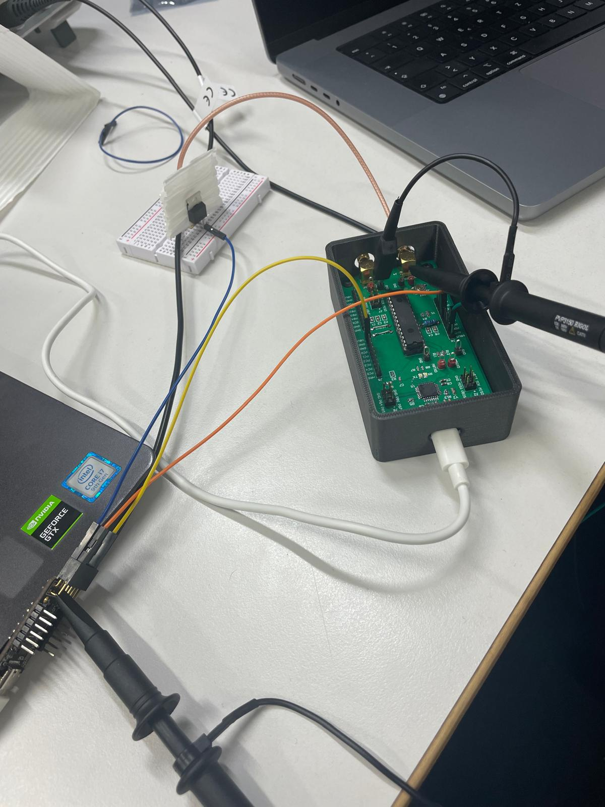
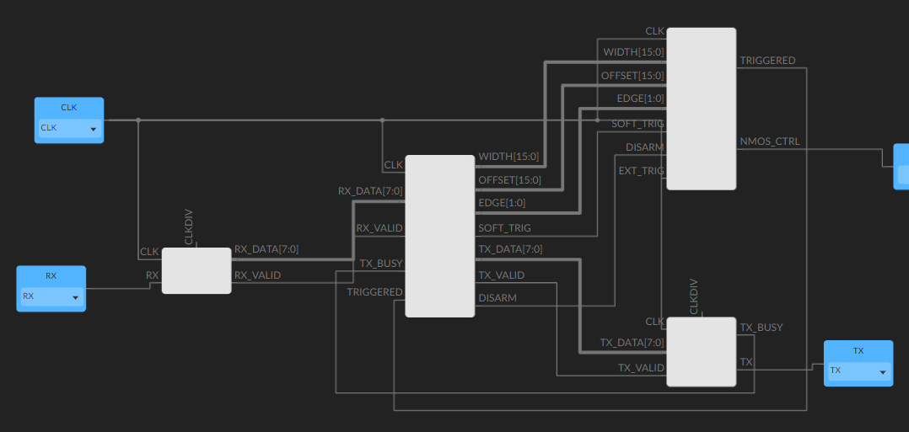

[🇨🇳 中文文档 | Chinese README](./README.zh-CN.md)

# 🛡️ Hardware Security Lab Project Documentation

## 📚 Project Overview
This project is a comprehensive code and data repository for a **Hardware Security Laboratory** course. It covers classic experiments such as SPA (Simple Power Analysis), DPA/CPA (Differential/Correlation Power Analysis), AES encryption/decryption side-channel attacks, and voltage fault injection. The structure is clear, including experiment scripts, data, result images, and key result txt files. It is suitable for teaching, reproduction, and further research.

---

## 🚩 Lab-0x00: Side-Channel Analysis & AES Attacks

### 1️⃣ SPA (Simple Power Analysis) Experiment
**Principle**
> SPA analyzes the power traces of cryptographic chips under different operations to directly infer key-related operations. For example, in the "square-and-multiply" algorithm, different power trace shapes reveal key bits.

**Steps**
1. Use `000_infinite.py` to generate continuous cryptographic operations.
2. Collect power traces with `001_powertrace_recording.py`.
3. Analyze traces and locate key features with `002_powertrace_analysis.py`.

**Key Scripts**
- `000_infinite.py`: Loops encryption operations for sufficient data.
- `001_powertrace_recording.py`: Uses oscilloscope API to collect and save traces.
- `002_powertrace_analysis.py`: Processes and visualizes collected traces.

**Sample Results**
- Power trace example:
  
- Key inference result:
  ```text
  # 0x00/000_SPA/result.txt
  key-bin: 0000 1000 0001 1010 1011 0001 1110 0011
  key-hex: 0x0 0x8 0x1 0xa 0xb 0x1 0xe 0x3
  ```

---

### 2️⃣ AES Encryption DPA Experiment (001_AES_ENCIPHER)
**Principle**
> DPA (Differential Power Analysis) statistically analyzes power differences across many encryption operations. By correlating key guesses with actual power, each AES key byte can be recovered.

**Steps**
1. `000_infinite.py` for continuous encryption.
2. `001_powertrace_recording.py` to collect multiple traces.
3. `002_powertrace_analysis.py` for DPA on each byte, outputting correlation curves.
4. `003_verify.py` to verify recovered keys.

**Key Scripts**
- `002_powertrace_analysis.py`: Core DPA analysis, outputs correlation for each byte.
- `result_plots/`: Contains 16 DPA result images, e.g.:
  
- `result.txt`: Recovered 16-byte key:
  ```text
  # 0x00/001_AES_ENCIPHER/result.txt
  the 0th key: 194.
  the 1st key: 80.
  ...
  the 15th key: 34.
  ```

---

### 3️⃣ AES Decryption CPA Experiment (002_AES_DECIPHER)
**Principle**
> CPA (Correlation Power Analysis) is similar to DPA but uses Pearson correlation to measure the relationship between key guesses and power, suitable for AES decryption.

**Steps**
1. `000_infinite.py` for continuous decryption.
2. `001_powertrace_recording.py` to collect traces.
3. `002_powertrace_analysis.py` for CPA on each byte.
4. `003_verify.py` to verify keys.
5. `004_reverse_key_expansion.py` for reverse key expansion to get the first round key.

**Key Scripts**
- `002_powertrace_analysis.py`: Main CPA analysis.
- `key_expansion.py`, `004_reverse_key_expansion.py`: Key expansion and reverse expansion.
- `result_plots/`: CPA result images, e.g.:
  
- `result.txt`: Last and first round keys:
  ```text
  # 0x00/002_AES_DECIPHER/result.txt
  1st key-byte: 0x4e.
  ...
  16th key-byte: 0x0d.
  4e 54 5c d7 cf fa 97 2d f1 42 75 97 1d 95 3f 0d
  After reverse key expansion:
  2a c3 0b db fe e2 7f 07 b0 3b e6 93 73 1a b7 86
  ```

### Data (Dropbox)
- [000_SPA](https://www.dropbox.com/scl/fi/8osanbxhln5ajkfgwjmgm/float_data.csv?rlkey=z5jxwherlhyw0dd46d5loxpoo&dl=0)
- [001_AES_ENCIPHER](https://www.dropbox.com/scl/fi/8xgf6e9tmrsij22590ypx/data_dpa.zip?rlkey=zti9q9cmi7oqrm516x8lk5h03&dl=0)
- [002_AES_DECIPHER](https://www.dropbox.com/scl/fi/08yzk56a7urrj3r3z8cxp/data_cpa.zip?rlkey=7ky2l75pn4lcqychmp6snvzbz&dl=0)

---

## ⚡ Lab-0x01: Voltage Fault Injection & icestudio

### 1️⃣ Voltage Fault Injection Experiment
**Principle**
> By briefly disturbing the target chip's power supply (glitch), faults are induced at specific times, enabling security bypass or key leakage.

**Steps**
1. Use `python/glitch_ctrl.py` to control the glitch device.
2. `c1-test_with_dut.py` for DUT (Device Under Test) interaction.
3. `c2-chara_VFI.py`, `c3-plot.py` for fault window and waveform analysis.
4. `c4-glitch_attack.py` for attack, `c5-verify.py` for verification.

**Key Scripts**
- `glitch_ctrl.py`: Main glitch control script.
- `dut.py`: DUT communication and control.
- `outcomes/log.txt`, `log_11_21.txt`, `seeds.txt`: Experiment logs and results.
- `outcomes/figs/`: Result images, e.g.:
  - Fault window: 
  - Attack result: 
  - Circuit: 
  - icestudio design: 

**Sample Results**
- Fault injection log:
  ```text
  # 0x01/outcomes/log.txt
  ------width:10-10 offset:2000-3999
  offset:2045 width:10 crashed
  ...
  ```
- Seed data:
  ```text
  # 0x01/outcomes/seeds.txt
  Seeds requested being:
  tail
  stand
  ...
  ```

---

### 2️⃣ icestudio & Firmware
- `icestudio_blocks/`: UART, GLITCH_CTRL icestudio projects for FPGA design and simulation.
- `firmware/`: DUT firmware (.ino.elf, etc.) for hardware experiments.

---

## 📖 References
- [How to Voltage Fault Injection](https://www.synacktiv.com/publications/how-to-voltage-fault-injection)
- [YouTube Demo](https://www.youtube.com/watch?v=6Pf3pY3GxBM&t=101s)
- Course slides and handouts

---

## 🙏 Acknowledgements
Thanks to the Hardware Security course team for their support and guidance.

---

## 🗂️ File Structure

<details>
<summary>Click to expand</summary>

```text
HwSecLab-Hardware-Security/
├── 0x00/                  # Lab-0x00: SPA & AES SCA
│   ├── 000_SPA/           # SPA experiment
│   │   ├── 000_infinite.py
│   │   ├── 001_powertrace_recording.py
│   │   ├── 002_powertrace_analysis.py
│   │   ├── power_sample.png
│   │   ├── result.txt
│   │   ├── scope_api.py
│   │   └── square_and_multiply_api.py
│   ├── 001_AES_ENCIPHER/  # AES encryption DPA
│   │   ├── 000_infinite.py
│   │   ├── 001_powertrace_recording.py
│   │   ├── 002_powertrace_analysis.py
│   │   ├── 003_verify.py
│   │   ├── encipher_api.py
│   │   ├── result.txt
│   │   ├── scope_api.py
│   │   └── result_plots/
│   └── 002_AES_DECIPHER/  # AES decryption CPA
│       ├── 000_infinite.py
│       ├── 001_powertrace_recording.py
│       ├── 002_powertrace_analysis.py
│       ├── 003_verify.py
│       ├── 004_reverse_key_expansion.py
│       ├── decipher_api.py
│       ├── key_expansion.py
│       ├── result.txt
│       ├── scope_api.py
│       ├── result_plots/
│       └── reverse_key_expansion/
├── 0x01/                  # Lab-0x01: Fault Injection & icestudio
│   ├── python/            # Python scripts
│   ├── outcomes/          # Results & images
│   ├── icestudio_blocks/  # icestudio projects
│   └── firmware/          # Firmware
├── README.md              # English/Chinese documentation
└── 说明文档.md            # 中文详细说明（archived）
```

</details> 