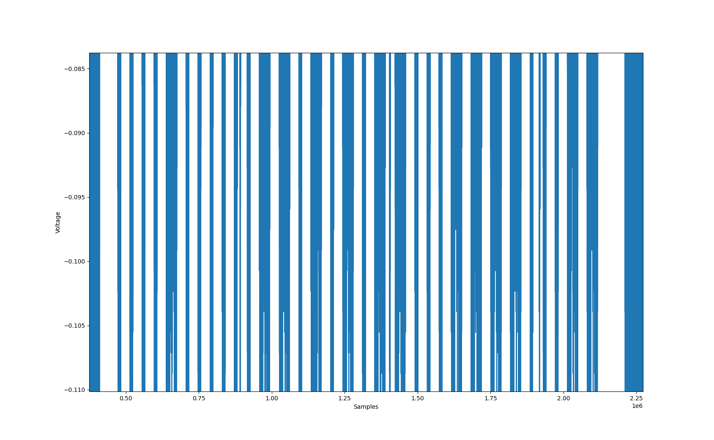
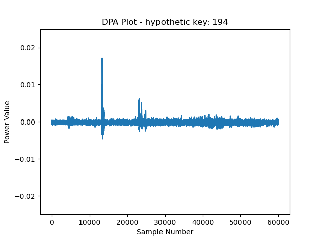
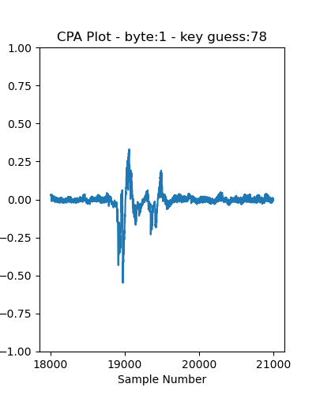
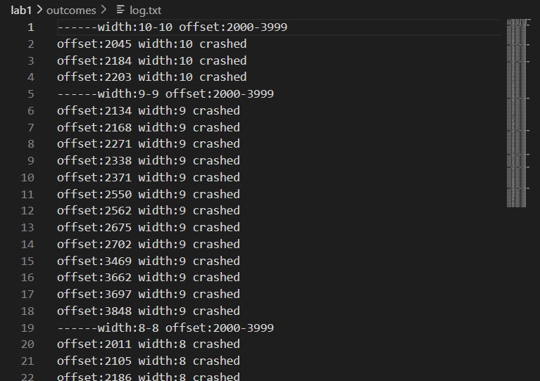
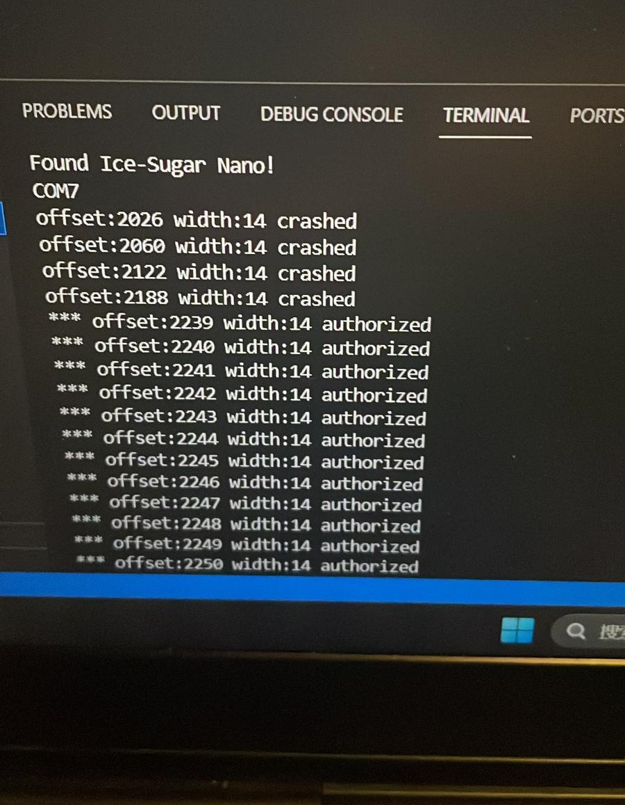
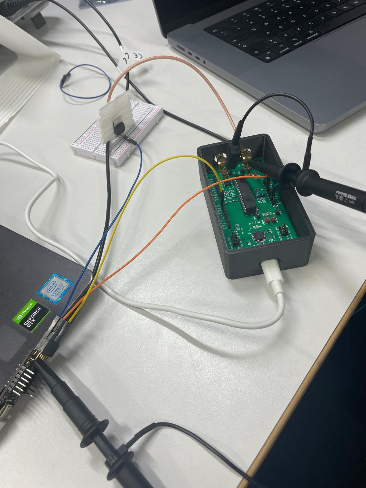

[🇺🇸 English | English README](./README.md)

# 🛡️ 硬件安全实验项目说明文档

## 📚 项目简介
本项目为**硬件安全实验课程**的配套代码与实验数据，涵盖了 SPA（简单功耗分析）、DPA/CPA（差分/相关功耗分析）、AES加解密侧信道攻击、电源故障注入等多个经典实验。

---

## 🚩 Lab-0x00 侧信道分析与AES攻击

### 1️⃣ SPA（Simple Power Analysis）实验
**实验原理**
> SPA 通过分析加密芯片在不同操作下的功耗波形，直接推断密钥相关操作。以"平方-乘法"算法为例，功耗波形的不同形态可揭示密钥比特。

**实验步骤**
1. 使用 `000_infinite.py` 生成持续运行的加密操作。
2. 通过 `001_powertrace_recording.py` 采集功耗波形。
3. 用 `002_powertrace_analysis.py` 对波形进行分析，定位密钥相关特征。

**关键脚本说明**
- `000_infinite.py`：循环执行加密操作，便于采集足够多的功耗数据。
- `001_powertrace_recording.py`：调用示波器API，采集并保存功耗波形。
- `002_powertrace_analysis.py`：对采集到的波形进行处理和可视化。

**典型结果**
- 功耗波形示例：
  
- 密钥推断结果：
  ```text
  # 0x00/000_SPA/result.txt
  key-bin: 0000 1000 0001 1010 1011 0001 1110 0011
  key-hex: 0x0 0x8 0x1 0xa 0xb 0x1 0xe 0x3
  ```

---

### 2️⃣ AES加密 DPA 实验（001_AES_ENCIPHER）
**实验原理**
> DPA（差分功耗分析）通过统计大量加密操作下的功耗差异，利用密钥猜测与实际功耗的相关性，逐字节恢复 AES 密钥。

**实验步骤**
1. `000_infinite.py` 生成持续加密操作。
2. `001_powertrace_recording.py` 采集多组加密功耗波形。
3. `002_powertrace_analysis.py` 对每个字节进行 DPA 分析，输出相关性曲线。
4. `003_verify.py` 对恢复的密钥进行验证。

**关键脚本说明**
- `002_powertrace_analysis.py`：核心 DPA 分析，输出每字节的相关性图。
- `result_plots/`：存放 16 个密钥字节的 DPA 分析图片，如：
  
- `result.txt`：记录恢复的 16 字节密钥：
  ```text
  # 0x00/001_AES_ENCIPHER/result.txt
  the 0th key: 194.
  the 1st key: 80.
  ...
  the 15th key: 34.
  ```

---

### 3️⃣ AES解密 CPA 实验（002_AES_DECIPHER）
**实验原理**
> CPA（相关功耗分析）与 DPA 类似，但采用皮尔逊相关系数度量密钥猜测与功耗的相关性，适用于 AES 解密。

**实验步骤**
1. `000_infinite.py` 生成持续解密操作。
2. `001_powertrace_recording.py` 采集多组解密功耗波形。
3. `002_powertrace_analysis.py` 对每个字节进行 CPA 分析。
4. `003_verify.py` 验证恢复密钥。
5. `004_reverse_key_expansion.py` 实现逆密钥扩展，推算首轮密钥。

**关键脚本说明**
- `002_powertrace_analysis.py`：CPA 分析主脚本。
- `key_expansion.py`、`004_reverse_key_expansion.py`：密钥扩展与逆扩展实现。
- `result_plots/`：存放 CPA 分析图片，如：
  
- `result.txt`：记录恢复的末轮密钥与首轮密钥：
  ```text
  # 0x00/002_AES_DECIPHER/result.txt
  1st key-byte: 0x4e.
  ...
  16th key-byte: 0x0d.
  4e 54 5c d7 cf fa 97 2d f1 42 75 97 1d 95 3f 0d
  After reverse key expansion:
  2a c3 0b db fe e2 7f 07 b0 3b e6 93 73 1a b7 86
  ```

### Data -> dropbox

[000_SPA](https://www.dropbox.com/scl/fi/8osanbxhln5ajkfgwjmgm/float_data.csv?rlkey=z5jxwherlhyw0dd46d5loxpoo&dl=0)
[001_AES_ENCIPHER](https://www.dropbox.com/scl/fi/8xgf6e9tmrsij22590ypx/data_dpa.zip?rlkey=zti9q9cmi7oqrm516x8lk5h03&dl=0)
[002_AES_DECIPHER](https://www.dropbox.com/scl/fi/08yzk56a7urrj3r3z8cxp/data_cpa.zip?rlkey=7ky2l75pn4lcqychmp6snvzbz&dl=0)

---

## ⚡ Lab-0x01 电源故障注入与 icestudio 实验

### 1️⃣ 电源故障注入实验
**实验原理**
> 通过对目标芯片电源进行短暂扰动（glitch），诱发芯片在特定时刻出错，实现安全机制绕过或密钥泄露。

**实验步骤**
1. 使用 `python/glitch_ctrl.py` 等脚本控制故障注入设备。
2. `c1-test_with_dut.py` 等脚本与 DUT（被测设备）交互。
3. `c2-chara_VFI.py`、`c3-plot.py` 等脚本分析故障窗口与波形。
4. `c4-glitch_attack.py` 实施攻击，`c5-verify.py` 验证攻击效果。

**关键脚本说明**
- `glitch_ctrl.py`：故障注入主控脚本。
- `dut.py`：被测设备通信与控制。
- `outcomes/log.txt`、`log_11_21.txt`、`seeds.txt`：记录实验过程与结果。
- `outcomes/figs/`：存放实验结果图片，如：
  - 故障窗口统计：
  - 攻击结果示例：
  - 电路图：
  - icestudio 设计：

**典型结果**
- 故障注入 log 片段：
  ```text
  # 0x01/outcomes/log.txt
  ------width:10-10 offset:2000-3999
  offset:2045 width:10 crashed
  ...
  ```
- 种子数据片段：
  ```text
  # 0x01/outcomes/seeds.txt
  Seeds requested being:
  tail
  stand
  ...
  ```

---

### 2️⃣ icestudio 与固件实验
- `icestudio_blocks/`：包含 UART、GLITCH_CTRL 等 icestudio 工程文件，可用于 FPGA 逻辑设计与仿真。
- `firmware/`：包含 DUT 固件（.ino.elf 等），配合硬件实验。

---

## 📖 参考资料
- [如何做电压故障注入](https://www.synacktiv.com/publications/how-to-voltage-fault-injection)
- [YouTube 演示](https://www.youtube.com/watch?v=6Pf3pY3GxBM&t=101s)
- 课程 PPT 与讲义

---

## 🙏 致谢
感谢硬件安全课程组的支持与指导。

---

## 🗂️ 文件结构

<details>
<summary>点击展开查看详细结构</summary>

```text
HwSecLab-Hardware-Security/
├── 0x00/                  # Lab-0x00：SPA与AES侧信道攻击
│   ├── 000_SPA/           # SPA实验
│   │   ├── 000_infinite.py
│   │   ├── 001_powertrace_recording.py
│   │   ├── 002_powertrace_analysis.py
│   │   ├── power_sample.png
│   │   ├── result.txt
│   │   ├── scope_api.py
│   │   └── square_and_multiply_api.py
│   ├── 001_AES_ENCIPHER/  # AES加密DPA实验
│   │   ├── 000_infinite.py
│   │   ├── 001_powertrace_recording.py
│   │   ├── 002_powertrace_analysis.py
│   │   ├── 003_verify.py
│   │   ├── encipher_api.py
│   │   ├── result.txt
│   │   ├── scope_api.py
│   │   └── result_plots/
│   └── 002_AES_DECIPHER/  # AES解密CPA实验
│       ├── 000_infinite.py
│       ├── 001_powertrace_recording.py
│       ├── 002_powertrace_analysis.py
│       ├── 003_verify.py
│       ├── 004_reverse_key_expansion.py
│       ├── decipher_api.py
│       ├── key_expansion.py
│       ├── result.txt
│       ├── scope_api.py
│       ├── result_plots/
│       └── reverse_key_expansion/
├── 0x01/                  # Lab-0x01：电源故障注入与icestudio实验
│   ├── python/            # Python脚本
│   ├── outcomes/          # 实验结果与图片
│   ├── icestudio_blocks/  # icestudio工程文件
│   └── firmware/          # 固件
├── README.md              # 英文简要说明
└── 说明文档.md            # 中文详细说明（本文件）
```

</details> 